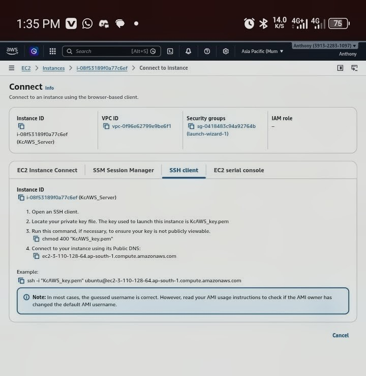
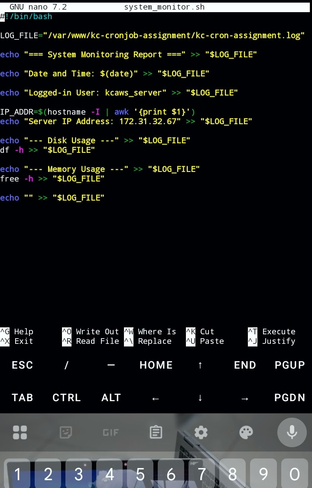
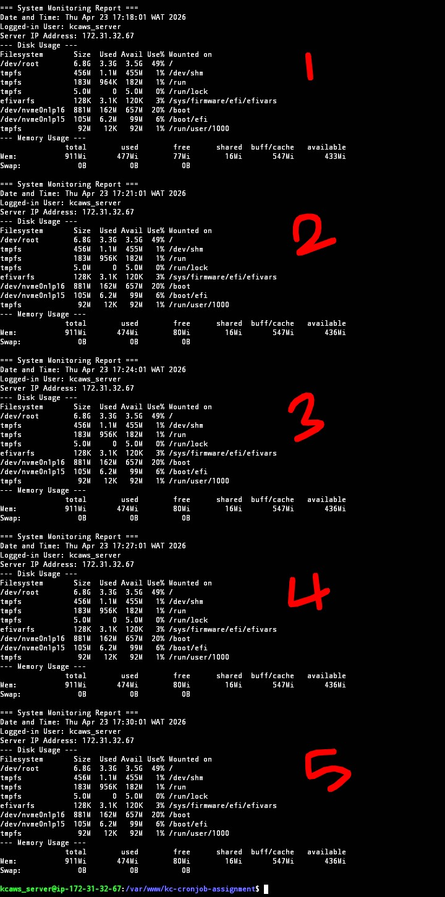
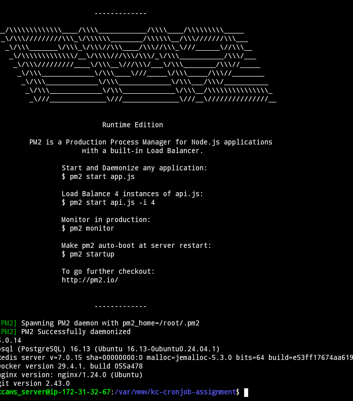

# System Monitoring with Bash & Cron

A bash script that automatically collects and logs system information 
every 3 minutes using a cron job — deployed on an AWS EC2 instance.

## What It Logs
- Current date and time
- Logged-in user
- Server IP address
- Disk usage
- Memory usage

## Output
All logs are appended to `kc-cron-assignment.log`

## How to Use

### 1. Make the script executable
chmod +x system_monitor.sh

### 2. Run it manually (to test)
./system_monitor.sh

### 3. Automate with Cron (every 3 minutes)
Open crontab:
crontab -e

Add this line:
*/3 * * * * /path/to/system_monitor.sh

### 4. View the logs
cat ~/kc-cron-assignment.log

## Tools & Environment
- **Bash**
- **AWS EC2** (Ubuntu)
- **Cron**
- **Termux** (Android) — used to SSH into the EC2 instance remotely

## Resources Installed on Server
- Git
- Docker
- PostgreSQL

## Screenshots

**Image 1 — SSH Connection to AWS EC2**

**Image 2 — Bash Script**

**Image 3 — Log Output**

**Image 4 — Resources Installed**

